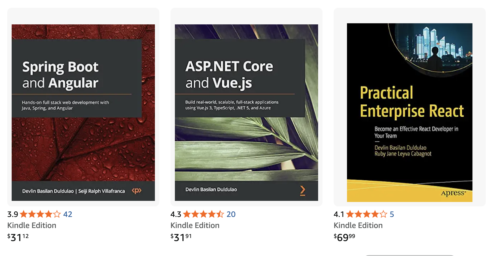

<!--
  Hei! 👋 This is my GitHub profile README.
  The repo name "devlinduldulao" matches my username, so GitHub renders this file
  on github.com/devlinduldulao. Tiny trick, big effect.
-->

<p align="center">
  <a href="https://www.amazon.com/Devlin-Basilan-Duldulao/e/B08KSGGZ4Z">
    
  </a>
</p>

<h1 align="center">Devlin Duldulao</h1>

<p align="center">
  <b>Creator of <a href="https://daloyjs.dev/">DaloyJS</a></b> · Software engineer · Educator · Published author<br/>
  <sub>Filipino in Norway 🇵🇭→🇳🇴 · Writes TypeScript and recipes with equal seriousness</sub>
</p>

<p align="center">
  <a href="https://daloyjs.dev/"></a>
  <a href="https://www.amazon.com/Devlin-Basilan-Duldulao/e/B08KSGGZ4Z"></a>
  
</p>

---

## About me

Devlin Duldulao is the creator of **DaloyJS**, a software engineer, educator, and published author with **10+ years** of experience building and teaching modern web development. Originally from the **Philippines** and based in **Norway since 2019**, he writes books and courses for developers who want to ship real, secure systems — and takes his Asian home cooking about as seriously as his TypeScript.

A few honest disclaimers:

- I speak English well, but it's not my first language. If a sentence sounds off, that's the spice, not a bug.
- I am Filipino, which is a federally protected reason to make dad jokes inside pull requests.
- I have strong opinions about garlic, fish sauce, and `tsconfig.json` — usually in that order.

## What I'm building

- 🌊 **[DaloyJS](https://daloyjs.dev/)** — the framework I'm pouring my brain into. Built for developers who want flow, not friction.
- 📚 **Books & Courses** — long-form material for engineers who'd rather understand than copy-paste.
- 🧪 **Side experiments** — mostly Next.js + shadcn/ui + Tailwind, occasionally something I'll regret in six months.

## My current stack

```ts
const devlin = {
  framework:   ["Next.js (App Router)", "DaloyJS"],
  ui:          ["shadcn/ui", "Tailwind CSS", "Radix"],
  language:    ["TypeScript", "a little Norwegian", "fluent Filipino sarcasm"],
  backend:     ["Node.js", ".NET", "Spring Boot", "Postgres"],
  loves:       ["clean types", "boring deployments", "spicy food"],
  avoids:      ["any", "console.log in main", "pineapple on adobo"],
} as const;
```

## Books published

- **ASP.NET Core and Vue.js** — Packt · *sole author*
- **Practical Enterprise React** — Apress · *co-author*
- **Spring Boot and Angular** — Packt · *co-author*

All three were written **during the pandemic and before the large-language-model era** — no ChatGPT, no Copilot, just compiler errors, Stack Overflow tabs, and a stubborn refusal to ship something I didn't understand. I'm genuinely proud of that.

> If you bought one: thank you. If you pirated one: I forgive you, but write a review.

## Find me elsewhere

- 🌐 Web — [daloyjs.dev](https://daloyjs.dev/)
- 📦 Amazon — [Author page](https://www.amazon.com/Devlin-Basilan-Duldulao/e/B08KSGGZ4Z)
- 💼 LinkedIn — [in/devlinduldulao](https://www.linkedin.com/in/devlinduldulao/)
- 🐦 X — [@devlinduldulao](https://x.com/devlinduldulao)
- 📸 Instagram — [@devlinduldulao](https://www.instagram.com/devlinduldulao/)

---

<p align="center">
  <sub>Built with too much coffee in Oslo. Garlic optional but recommended.</sub>
</p>
